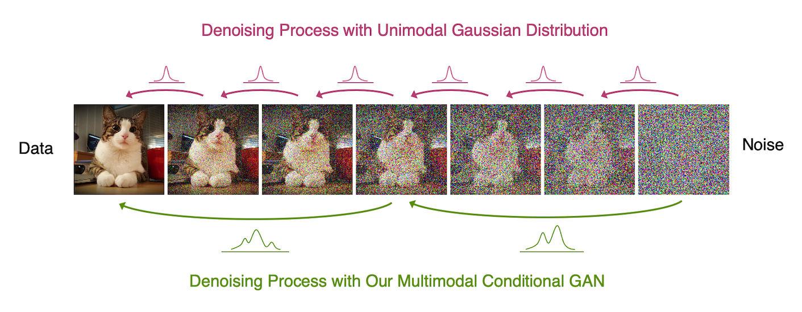

## 
Tackling the Generative Learning Trilemma with Denoising Diffusion GANs

  <a href="https://xavierxiao.github.io/" target="_blank">Zhisheng&nbsp;Xiao</a> &emsp; <b>&middot;</b> &emsp;
  <a href="https://karstenkreis.github.io/" target="_blank">Karsten&nbsp;Kreis</a> &emsp; <b>&middot;</b> &emsp;
  <a href="http://latentspace.cc/" target="_blank">Arash&nbsp;Vahdat</a> &emsp; <b>
     
  <a href="https://nvlabs.github.io/denoising-diffusion-gan" target="_blank">Project&nbsp;Page</a>

  

:construction: :pick: :hammer_and_wrench: :construction_worker:

Code coming soon (the current expected release is in March 2022). Stay tuned!

  

    

